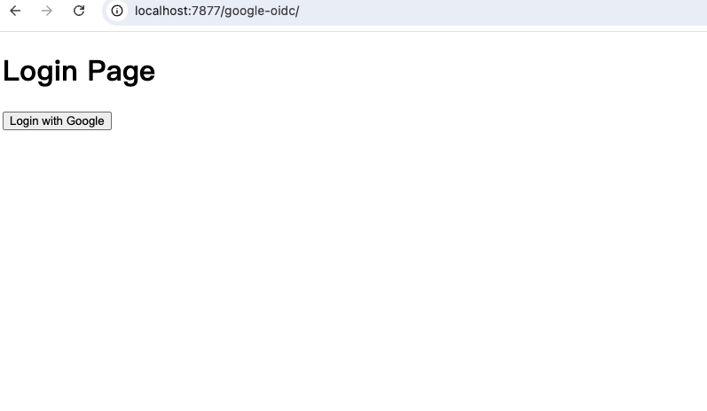
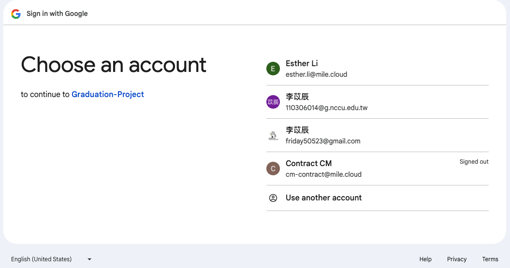
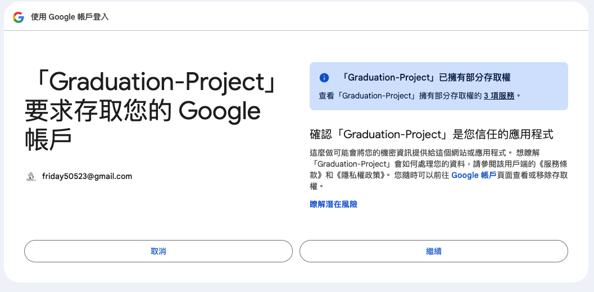
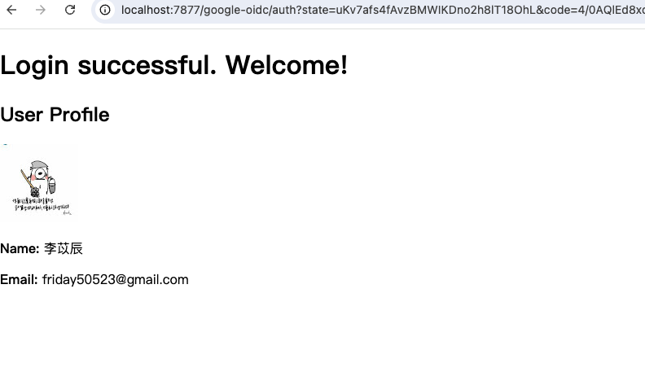

## Google OIDC Login Python Example
### Prerequisites
- Navigate to the Google Cloud API Credentials page at [Google Cloud Console](!https://console.cloud.google.com/) and create a new project.
- Follow the instructions on this page to register a client: [Google OAuth 2.0 Integration Guide](!https://growingdna.com/google-oauth-2-0-for-3rd-party-login/). Please set two redirect URIs: http://localhost:7877/google-oidc/auth and http://localhost:7877/google-oidc/login.
- After registering, add yourself as a test user and download the OAuth client JSON file. Rename this file to client.json and place it in your project directory. 


### Start the Example Client Web app
Update your `.env` file.
```
GOOGLE_CLIENT_ID=[YOUR_GOOGLE_CLIENT_ID]
GOOGLE_CLIENT_SECRET=[YOUR_GOOGLE_CLIENT_SECRET]
GOOGLE_REDIRECT_URI='http://localhost:7877/google-oidc/auth'
```

Start the example web app.
```python
uvicorn main:app --host localhost --port 7877 --reload
```
Visit http://localhost:7877/google-oidc/ to see the test results.


### Expected Result



